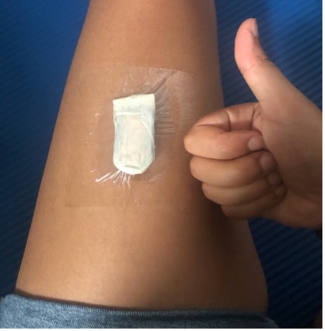

I did not hesitate much to chose what I would write on for this first blog article. The activPAL has been my companion since I started doing research as a PhD student. It is not perfect, but I have used it in every single one of my human subject studies so far. Here is why.

# Table of Content
1. What is the activPAL?
2. Technical specifications and attachment
3. Why and how do I use it?
4. Software and outputs
5. My personal opinion

# What is the activPAL?

[The activPAL](https://www.palt.com) is a thigh-worn accelerometer in the form of a thin (23.5 x 43 x 5 mm), lightweight chip (9g).   

It integrates a proprietary algorithm that classifies activities as lying, sitting, standing, stepping, cycling, and driving. This technology belongs to the company [Pal Technologies](https://www.palt.com/about-us/) created in 2001, in Glasgow, Scotland. Its latest version, the activPAL4, was released in 2018. The activPAL comes with a full suite of softwares to configure, download, process, and visualize the data.

# Technical specifications and attachment

|                    | activPAL            |
| ------------------ |:-------------------:|
| Measurement        | 3-axes acceleration |
| Range              | +/- 4g              |
| Sampling frequency | 20 or 40Hz          |
| Memory size        | 64MB                |
| Battery life       | 14 days+            |
| Charge time        | 3 hours             |

The activPAL requires a placement on the thigh. It is first placed within a protective nitrile sleeve to make it waterproof and is attached on the thigh using medical tape.

# Why and how do I use it?

